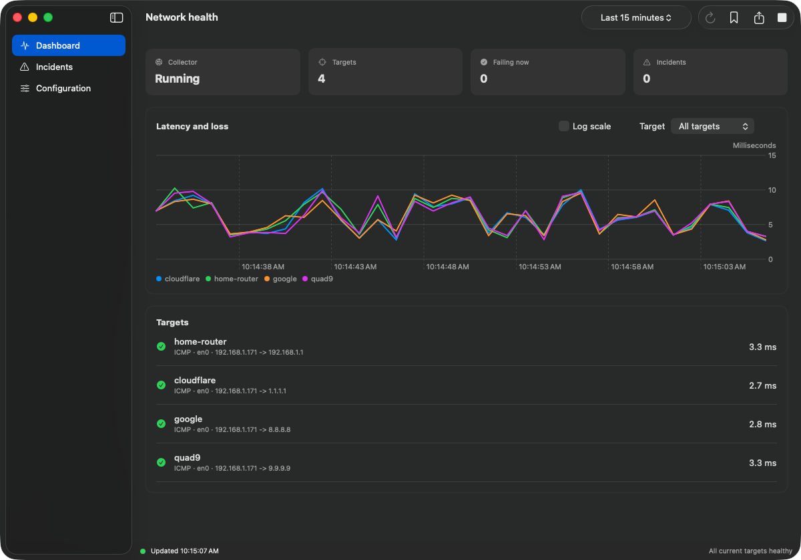
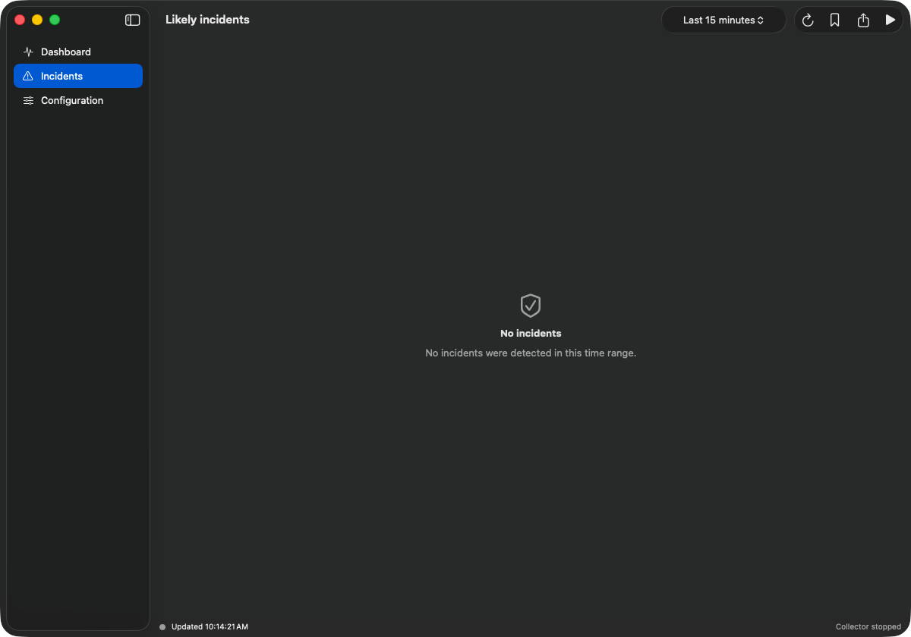

# netprobe

`netprobe` records enough context to answer a frustratingly specific question: *was that five-second interruption my LAN, my ISP, the VPN, the work network, or just the remote service?*

It runs ICMP, TCP, DNS, and HTTP probes on independent schedules, stores the results in a local SQLite database, groups related failures into likely incidents, and exports offline HTML, CSV, and JSON reports. Use the native macOS app or the same collector from a terminal on macOS, Linux, and Windows.



The screenshot uses the included example configuration. Its VPN and work targets are placeholders, so those failures are expected.

## macOS quick start

The GUI requires macOS 13 or newer. Build the universal Apple Silicon/Intel app with Xcode and Go 1.24 or newer:

```text
./scripts/build-macos-app.sh
open dist/Netprobe.app
```

Once the app opens:

1. Open **Configuration** and choose **Install Example**.
2. Replace the placeholder hosts with the router, public endpoint, VPN, DNS server, or service you want to measure.
3. Choose **Save and Validate**.
4. Press **Start** in the toolbar.
5. Add a marker when something breaks, then export an HTML report for the same time range.

Closing the window leaves Netprobe available from the menu bar. Choosing **Quit Netprobe** stops a collector started by the app.

Development builds are ad-hoc signed. To create a Developer ID build, provide the exact identity listed by `security find-identity -v -p codesigning`:

```text
NETPROBE_VERSION=0.1.0 \
NETPROBE_CODESIGN_IDENTITY="Developer ID Application: Your Name (TEAMID)" \
./scripts/build-macos-app.sh
```

The signed app still needs Apple notarization before public distribution.

## Terminal quick start

Build the command-line application:

```text
go build -trimpath -ldflags "-s -w" -o netprobe ./cmd/netprobe
```

Copy `netprobe.example.yaml` to the normal configuration directory and replace its example hosts:

- macOS: `~/Library/Application Support/netprobe/config.yaml`
- Windows: `%AppData%\netprobe\config.yaml`
- Linux: `~/.config/netprobe/config.yaml`

Any location can be used with `--config PATH` or `NETPROBE_CONFIG`.

```text
netprobe config check
netprobe run
# In another terminal:
netprobe watch
netprobe mark "video froze during customer call"
netprobe incidents --since 2h
netprobe report --since 2h --format html --output incident.html
```

Stop the collector with Ctrl-C or a normal termination signal. In-flight results finish or time out, SQLite commits are preserved, and the incident index is refreshed.

## Basic configuration

This is enough to distinguish a local network failure from a broader connectivity problem:

```yaml
database: netprobe.db
concurrency: 8
incident_window: 5s

targets:
  - name: home-router
    host: 192.168.1.1
    type: icmp
    interval: 1s
    timeout: 800ms
    tags: [local]

  - name: public-internet
    host: 1.1.1.1
    type: icmp
    interval: 1s
    timeout: 800ms
    tags: [public]
```

Replace `192.168.1.1` with your actual gateway. Add VPN, DNS, TCP, and HTTP targets from [`netprobe.example.yaml`](netprobe.example.yaml) once the basic pair works.

## Commands

```text
netprobe [--config PATH] run
netprobe [--config PATH] watch [--once] [--width 80] [--ascii] [--no-color]
netprobe [--config PATH] status
netprobe [--config PATH] mark [message]
netprobe [--config PATH] incidents [--since 1h | --from RFC3339 --to RFC3339] [--scope SCOPE]
netprobe [--config PATH] report [--incident ID | time flags] --format html|json [--output FILE]
netprobe [--config PATH] export [time flags] --format csv|json [--output FILE]
netprobe [--config PATH] config check
```

Time flags accept Go durations such as `30s`, `15m`, `2h`, and `336h`. RFC3339 timestamps always include a timezone. `watch --once` is suitable for scripts and non-interactive terminals. `--ascii` replaces Unicode plots; loss always uses `X`, so meaning never depends on color.

## Configuration reference

Global fields are `database`, `concurrency` (1–1024), `raw_retention`, `rollup_retention`, and `incident_window`. Each target has:

| Field | Meaning |
|---|---|
| `name`, `description` | Unique display name and optional explanation |
| `type` | `icmp`, `tcp`, `dns`, or `http` |
| `host` | ICMP/TCP host; required for those types |
| `port` | TCP port, 1–65535 |
| `resolver`, `query` | DNS server (port defaults to 53) and lookup name |
| `url` | Complete `http://` or `https://` URL |
| `interval`, `timeout` | Positive durations; timeout may not exceed interval |
| `source`, `interface` | Optional source IP and interface label |
| `enabled` | Defaults to true |
| `tags` | Diagnostic roles: `local`, `public`, `vpn`, `work`, `service` |

Unknown fields, duplicate names, missing type-specific settings, invalid URLs and addresses, and unsafe duration relationships produce field-specific validation errors. Binding by source IP is portable. `interface` records the intended interface label; the active interface is derived from the actual source address and stored on every result.

## How classification works

Classifications are deliberately worded as **likely**. They are evidence summaries, not proof:



- **local network** — a `local` gateway and downstream targets fail together.
- **ISP or upstream** — a local target remains reachable while `public` targets fail.
- **VPN or work network** — public connectivity stays healthy while `vpn`/`work` targets fail.
- **remote service** — public connectivity stays healthy while the relevant `service` probe fails.
- **ambiguous** — coverage is insufficient or evidence conflicts.

Failures and large latency increases within `incident_window` are grouped. The database retains affected probes, loss, route/source details, nearby markers, and a plain-language rationale. Place tags by diagnostic role: a VPN server's *public* address should usually carry both `public` and `vpn`, while an internal address should carry `vpn`/`work`.

## ICMP permissions

ICMP failure never stops TCP, DNS, or HTTP probes.

- **Windows:** the build calls the native IP Helper API (`IcmpSendEcho`) and normally needs no elevation.
- **macOS:** unprivileged datagram ICMP sockets are used. If endpoint security blocks them, allow the signed `netprobe` executable in that product; do not run the whole collector as root.
- **Linux:** enable unprivileged ping sockets for the collector's group with `net.ipv4.ping_group_range`. If policy forbids that, grant only `cap_net_raw` to the installed executable (`setcap cap_net_raw=ep /path/to/netprobe`). Moving/replacing the binary removes that file capability. Broad root execution is neither required nor recommended.

The exact socket error and this narrow remediation are recorded as `permission`; other probes continue.

## VPN and route diagnosis

Every successful connection records the resolved destination, selected source address, derived interface, and a compact route (`source -> destination`). A source/route change becomes a `network_change` event shown beside incidents and in reports. Configure both outside-the-tunnel targets (router, public endpoint, VPN public endpoint) and inside-the-tunnel targets (work DNS/host/service). Without both sides, VPN and ISP failures are usually ambiguous.

## Storage, privacy, and resource use

Raw observations default to 14 days, minute rollups to one year, and incidents/markers indefinitely. Retention runs in short WAL transactions and readers do not block the collector. Rollups preserve count, successes, loss, min/median/max/mean, mean absolute successive jitter, and p90/p95/p99. Sleep/wake, wall-clock shifts, collector downtime, and route changes are stored separately, not counted as packet loss.

At one-second intervals, allow roughly **15–35 MB per target per 14 days**, depending mostly on address and error text length: about 75–175 MB for 5 targets, 150–350 MB for 10, and 0.75–1.75 GB for 50. Normal CPU use is low; open operations are bounded by `concurrency`. Fifty HTTP/TLS probes every second can be intrusive—use longer HTTP intervals and reserve one-second sampling for small ICMP/TCP/DNS packets.

Exports contain configured target metadata and probe results only. They do not inventory the host, environment, other interfaces, cookies, response bodies, DNS answers, or TLS secrets. Error strings are truncated. URLs and hostnames are still potentially sensitive; review reports before sharing.

## Export schemas

JSON uses top-level schema `netprobe.export.v1`, UTC RFC3339 timestamps, `targets`, `observations`, minute `rollups`, `incidents`, `markers`, and `gaps`. Optional values are omitted. Historical HTML timelines combine raw observations with available minute rollups. CSV intentionally contains raw observations only and has this fixed v1 header:

```text
schema,timestamp_utc,target,probe_type,success,latency_ms,error_category,destination_address,source_address,interface,route
```

The HTML report embeds the same data and all CSS/JavaScript; it makes no network requests and opens directly from disk. Mouse-wheel/pinch zoom and drag pan operate on the synchronized timeline.

## Troubleshooting

- **All ICMP rows show permission:** follow the narrow platform guidance above; verify TCP/DNS continue.
- **Everything looks like an outage after sleep:** `status` and the report should show `sleep_or_wake`; those intervals are excluded from incident input.
- **VPN diagnosis is ambiguous:** add a public target outside the tunnel and internal work target, then verify stored source/interface values.
- **Database busy:** use only the `run` process as collector. WAL supports any number of `watch`/report readers, not multiple writers scheduling the same targets.
- **HTTP fails while browsing works:** the probe disables proxy discovery intentionally to measure the configured route. Configure a reachable health URL and expect non-2xx/3xx statuses to fail.

## Architecture and development

The shared packages separate configuration, scheduling, probe interfaces, storage/migrations, incident analysis, terminal rendering, and reporting. Platform ICMP lives behind build-tagged files; a fake `Prober` supports deterministic tests and leaves room for future distributed agents. Notifications can consume stored incidents later without entering the collection path.

Run `go test ./...` for deterministic tests. No automated test reaches the public internet. Build parity checks use:

```text
GOOS=linux GOARCH=amd64 CGO_ENABLED=0 go build ./cmd/netprobe
GOOS=windows GOARCH=amd64 CGO_ENABLED=0 go build ./cmd/netprobe
GOOS=darwin GOARCH=arm64 CGO_ENABLED=0 go build ./cmd/netprobe
```

Platform runners are still recommended for native ICMP integration tests because socket policy is controlled by each host. See `.github/workflows/ci.yml`.
