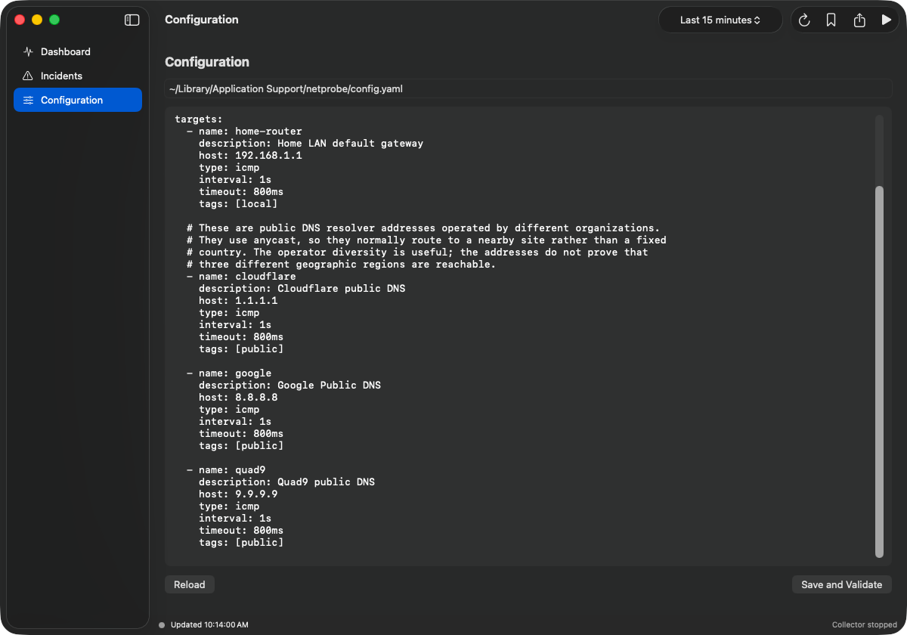

# netprobe

Five seconds of bad internet is easy to notice and hard to explain. `netprobe` keeps a small local record of your connection so you can see whether the problem was your router, your ISP, or the service you were using.

Press **Start** and leave it running. The default setup checks your home router plus public endpoints from Cloudflare, Google, and Quad9. If the connection stutters, the chart and incident view keep the useful context.


## Run it on macOS

Building the app requires Xcode and Go 1.24 or newer:

```text
./scripts/build-macos-app.sh
open dist/Netprobe.app
```

On the first launch:

1. Open **Configuration** and choose **Install Defaults**.
2. Choose **Save and Validate**.
3. Press **Start**.

Most home routers use `192.168.1.1`. Change that address if yours does not. The three public targets are ready to use.



The time menu changes how much history is visible. It does not stop collection. Pressing **Start** begins a clean dashboard view; earlier results stay available for reports.

The same collector also runs from a terminal on macOS, Linux, and Windows. See the [CLI and configuration guide](docs/cli.md), [advanced usage](docs/advanced.md), or [contributor guide](CONTRIBUTING.md) when you need more than the basic app.
